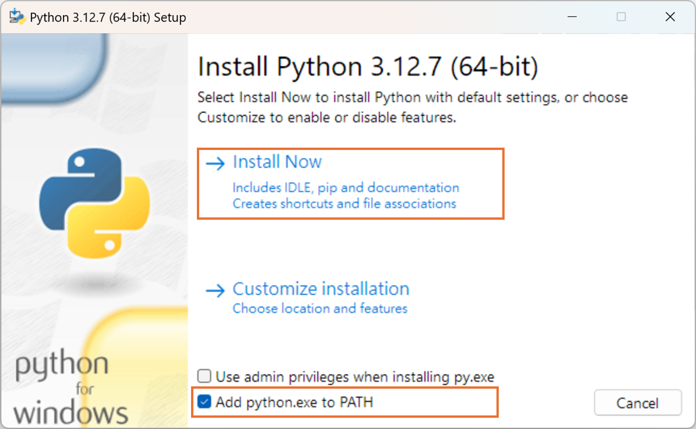
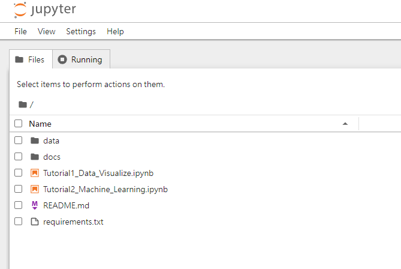

# DataCube AI Demo

Read in other languages: [Tiếng Việt](README_viet.md)

## 1. Setup Envrionment

### 1.1 Install Python

- Operate Ststem: Windows 11
- Download [Python 3.12 (x64)](https://www.python.org/ftp/python/3.12.7/python-3.12.7-amd64.exe) or get [other version](https://www.python.org/downloads/).
- Open exe file and install it.


### 1.2 Create python venv

```bash
>> python -m venv .venv
>> .venv/Scripts/activate
```

### 1.3 Install package

- via requirements.txt

```bash
>> pip install -r requirements.txt
```

- via pip directly

```bash
>> pip install jupyter matplotlib scikit-learn geopandas rasterio lightgbm
```

## 2. Download Data

- Download [Demo Data](https://thinktronltdcorp-my.sharepoint.com/:f:/g/personal/willie_wu_thinktronltd_com/ErtvtU-mdBRPhKH9fM4D-W4BEv7xU7iZajrWC3bT-n7X6w?e=P9iNiq).
- Put data into data folder, your folder should be look like:

```tree
datacube-ai-demo
├─data
│  ├─sentinel-2
|  |    └─XXX.zip
│  ├─shapefile
|  |    └─label.shp
│  └─weights
|       └─model.txt
...
```

## 3. Start

```bash
>> jupyter notebook
```

You will see the notebook look like:



- [Tutorial1 - Data Visualize](./Tutorial1_Data_Visualize.ipynb)
- [Tutorial2 - Machine Learning](./Tutorial2_Machine_Learning.ipynb)

You can try it on https://colab.research.google.com/github/sw-willie-wu/datacube-ai-demo/blob/main/Tutorial_on_Colab.ipynb